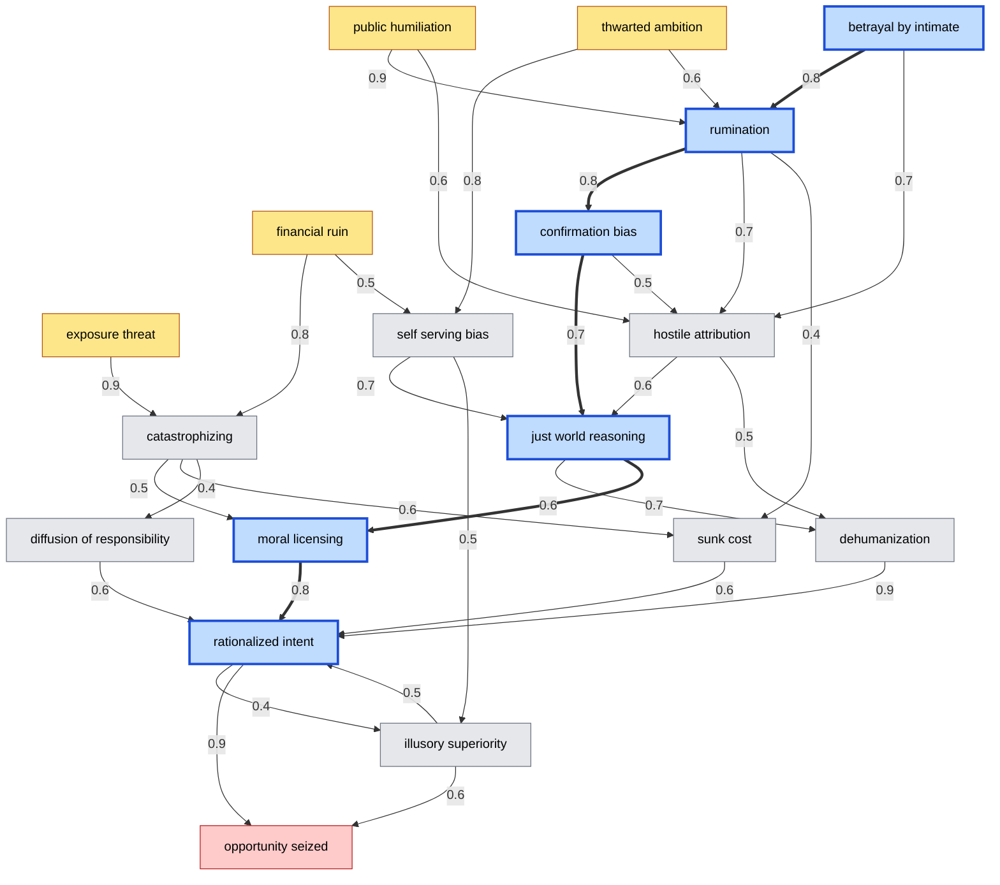

# Example motive path (seed 42)

Generated by `python3 motive.py --seed 42`. Blue is the walked path.

## States in order

1. betrayal_by_intimate — A partner, sibling, or close friend broke trust
2. rumination — Cannot stop replaying the grievance; it grows on each pass
3. confirmation_bias — Collects only the evidence that indicts the target
4. just_world_reasoning — Concludes the target brought it on themselves
5. moral_licensing — Past good conduct is felt to purchase this exception
6. rationalized_intent — The act is now justified to themselves; only means remain
